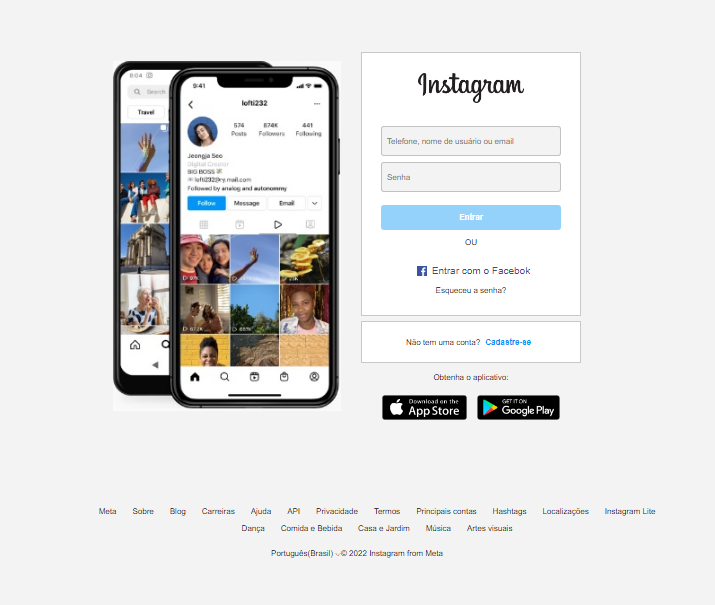

# Desafio-DIO-HTML5
## Desafio de Projeto - Página Inicial Instagram

Nesse projeto o desafio foi reconstruir a página de login do Instagram. 

Principal foco do projeto era a utilização Flexbox, uma das abordagens de posicionamento de elementos mais utilizadas quando se trata de responsividade. 

[Acesse aqui!](https://tiemi9.github.io/Desafio-DIO-HTML5)
